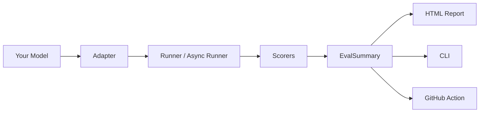

```
   ____                   ______          __
  / __ \____  ___  ____  / ____/___  ____/ /____
 / / / / __ \/ _ \/ __ \/ __/ / __ \/ __  / ___/
/ /_/ / /_/ /  __/ / / / /___/ / / / /_/ (__  )
\____/ .___/\___/_/ /_/_____/_/ /_/\__,_/____/
    /_/
```

[](https://pypi.org/project/openeval-ai/)


[](https://github.com/KaungHtetCho-22/openEval)

**Model-agnostic LLM evaluation that feels like pytest.**


## Install

```bash
pip install openeval-ai
```

Note: the PyPI project is `openeval-ai`, but you still `import openeval`.

Optional extras:

```bash
pip install "openeval-ai[openai]"      # OpenAI adapter
pip install "openeval-ai[anthropic]"   # Anthropic adapter
pip install "openeval-ai[semantic]"    # semantic_sim scorer
```

## Quickstart (10 lines, zero config)

```python
from openeval import EvalCase, run
from openeval.scorers import exact_match

cases = [EvalCase(input="2+2", expected_output="4")]

def my_model(prompt: str) -> str:
    return "4"

summary = run(my_model, cases, {"exact": exact_match})
print(summary.pass_rate)  # 1.0
```

## Why OpenEval

- **Scorers are just Python functions** — composable, testable, versionable.
- **Model-agnostic** — OpenAI, Anthropic, Ollama, or any callable.
- **CI-first** — pytest plugin + GitHub Action for evals on every PR.

## Architecture



## Comparison (benchmarks)

Benchmarks live in `benchmarks/` and use a fully offline mock model for reproducibility.

Measured on **2026-03-20** with `uv run benchmarks/run_all.py` (see `benchmarks/results.json`).

Task A: 20-case Q&A (exact match), mock model with 10ms latency per call.

| Tool | Setup (LOC) | Setup time (s) | Run time (s) | Notes |
|---|---:|---:|---:|---|
| OpenEval | 38 | 0.090 | 0.203 | ✅ |
| DeepEval | 44 | 2.250 | 0.261 | ✅ |
| Promptfoo | 50 | — | — | not run |

Notes:
- Promptfoo is optional in the harness; set `OPENEVAL_BENCH_PROMPTFOO=1` to run it.
- Promptfoo may require Node.js `>=20.20.0` or `>=22.22.0` (newer than `v22.17.x`).

## Built-in scorers

| Scorer | What it does |
|---|---|
| `exact_match` | 1.0 if output equals expected |
| `contains` | 1.0 if expected appears in output |
| `regex(pattern)` | 1.0 if output matches a regex |
| `semantic_sim` | cosine similarity via embeddings (optional extra) |
| `llm_judge(judge_fn)` | judge output quality 0.0–1.0 (bring your own judge) |

## Built-in suites

| Suite | What it tests |
|---|---|
| `hallucination` | admits uncertainty vs fabricates |
| `factuality` | basic factual QA |
| `instruction_following` | formatting/constraint compliance |

Run a suite:

```python
from openeval.suites import factuality
summary = factuality.run(lambda _: "Paris")
print(summary.pass_rate)
```

## GitHub Action

```yaml
# .github/workflows/eval.yml
name: LLM Eval
on: [pull_request]
jobs:
  eval:
    runs-on: ubuntu-latest
    steps:
      - uses: actions/checkout@v4
      - uses: KaungHtetCho-22/openEval/openeval-action@v1
        with:
          suite: hallucination
          model: openai:gpt-4o-mini
          threshold: "0.8"
        env:
          OPENAI_API_KEY: ${{ secrets.OPENAI_API_KEY }}
          GITHUB_TOKEN: ${{ secrets.GITHUB_TOKEN }}
```

## CLI

```bash
# Run a suite
openeval run --suite factuality --model ollama:llama3.2

# Parallel (async) + HTML report
openeval run --suite hallucination --model openai:gpt-4o-mini --async --concurrency 20 --output report.html
```

## Async evaluation

```python
import asyncio
from openeval import EvalCase, arun
from openeval.scorers import exact_match

cases = [EvalCase(input="2+2", expected_output="4")]

async def model(_prompt: str) -> str:
    return "4"

summary = asyncio.run(arun(model, cases, {"exact": exact_match}, concurrency=20))
print(summary.pass_rate)
```

## Examples

- `examples/01_basic_qa.py`
- `examples/02_openai_eval.py`
- `examples/03_compare_models.py`
- `examples/04_rag_eval.py`
- `examples/05_chatbot_eval.py`
- `examples/06_code_eval.py`
- `examples/07_custom_scorer.py`
- `examples/08_cicd_integration.py`

## Contributing

See `CONTRIBUTING.md`.

## License

MIT — see `LICENSE`.
